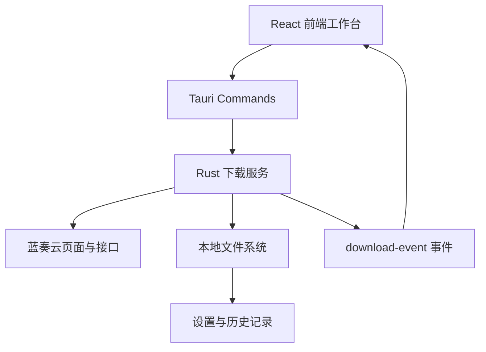

<div align="center">
  

  <h1>Lanzou Downloader</h1>

  <p><strong>一个基于 Rust + Tauri + React 的蓝奏云桌面下载器。</strong></p>
  <p>粘贴分享链接，选择保存目录，即可解析并下载蓝奏云分享中的文件。</p>

  <p>
    <a href="https://github.com/demogest/Lanzou/actions/workflows/tauri-build.yml">
      
    </a>
    <a href="https://github.com/demogest/Lanzou/actions/workflows/tauri-release.yml">
      
    </a>
    
    
    
    
  </p>
</div>

---

## 目录

- [功能亮点](#功能亮点)
- [界面与流程](#界面与流程)
- [快速开始](#快速开始)
- [开发命令](#开发命令)
- [打包与发布](#打包与发布)
- [项目结构](#项目结构)
- [数据与便携版](#数据与便携版)
- [注意事项](#注意事项)

## 功能亮点

<table>
  <tr>
    <td width="50%">
      <strong>批量下载</strong><br />
      支持解析蓝奏云分享页中的文件列表，并按任务顺序下载到指定目录。
    </td>
    <td width="50%">
      <strong>提取码支持</strong><br />
      对需要提取码的分享链接，可在下载前填写密码并自动完成解析。
    </td>
  </tr>
  <tr>
    <td width="50%">
      <strong>多进程并发</strong><br />
      下载进程数可配置，并会根据当前机器可用并行能力自动限制上限。
    </td>
    <td width="50%">
      <strong>实时进度</strong><br />
      展示总进度、每个进程的当前文件、下载状态与运行日志。
    </td>
  </tr>
  <tr>
    <td width="50%">
      <strong>下载历史</strong><br />
      本地保存最近 200 条任务记录，包含时间、目录、进程数和文件清单。
    </td>
    <td width="50%">
      <strong>任务取消</strong><br />
      运行中的下载任务可请求取消，临时 <code>.part</code> 文件会被清理。
    </td>
  </tr>
</table>

## 界面与流程




## 快速开始

### 环境要求

| 依赖 | 用途 |
| --- | --- |
| Node.js + npm | 安装前端依赖、启动 Vite、调用 Tauri CLI |
| Rust + Cargo | 编译 Tauri 后端与桌面应用 |
| WebView2 / WebKit | Tauri 运行时依赖，按系统平台要求安装 |

### 安装依赖

```shell
npm install
```

### 启动开发环境

```shell
npm run tauri:dev
```

应用会启动 Vite 开发服务器，并打开 Tauri 桌面窗口。

## 开发命令

| 命令 | 说明 |
| --- | --- |
| `npm run dev` | 仅启动 Vite 前端开发服务器，地址为 `127.0.0.1:1420` |
| `npm run build` | 构建前端静态资源到 `dist/` |
| `npm run tauri:dev` | 启动完整 Tauri 开发模式 |
| `npm run tauri:build` | 构建桌面安装包 |
| `cd src-tauri && cargo check` | 检查 Rust 后端代码 |

## 打包与发布

### 本地打包

```shell
npm run tauri:build
```

构建产物会生成在 `src-tauri/target/release/` 下。

### GitHub Actions

本仓库已配置跨平台构建与发布流程：

| Workflow | 触发方式 | 产物 |
| --- | --- | --- |
| `Build Tauri binaries` | 推送到 `main`、`codex/**`、Pull Request、手动触发 | Linux、Windows、macOS 构建产物 |
| `Release Tauri binaries` | 推送 `v*` 标签或手动触发 | GitHub Release 桌面安装包与 Windows 便携版 |

创建一个版本发布：

```shell
git tag v2.0.5
git push origin v2.0.5
```

发布流程会先创建草稿 Release，待所有平台构建成功后自动发布。

## 项目结构

```text
.
├── src/                    # React + Vite 前端
│   ├── components/          # 下载表单、进度面板、日志、设置、历史弹窗
│   └── lib/                 # 前端状态与格式化辅助函数
├── src-tauri/               # Rust + Tauri 后端
│   ├── src/client.rs        # 蓝奏云页面解析与下载地址解析
│   ├── src/downloader.rs    # 下载调度、并发、进度事件、文件写入
│   ├── src/storage.rs       # 设置、历史记录与便携版数据目录
│   └── tauri.conf.json      # Tauri 应用与打包配置
├── .github/workflows/       # CI 构建与 Release 发布流程
├── icon.png                 # 应用图标源文件
└── package.json             # 前端脚本与依赖
```

## 数据与便携版

| 模式 | 设置与历史位置 | 默认下载目录 |
| --- | --- | --- |
| 普通安装 | 系统应用数据目录 | 用户 `Downloads/Lanzou` |
| Windows 便携版 | 可执行文件旁的 `lanzou_data/` | 可执行文件旁的 `Downloads/` |

便携版通过文件名中的 `portable` 识别，例如：

```text
Lanzou-Downloader-2.0.5-windows-x64-portable.exe
```

## 注意事项

- 蓝奏云页面结构或接口参数变化时，解析逻辑可能需要更新。
- 已存在的目标文件会被跳过，不会重复覆盖。
- 下载过程中会先写入 `.part` 临时文件，完成后再重命名为最终文件。
- 当前应用面向桌面使用场景，不提供命令行批处理接口。

---

<div align="center">
  <sub>Built with Rust, Tauri, React and a very practical download button.</sub>
</div>
